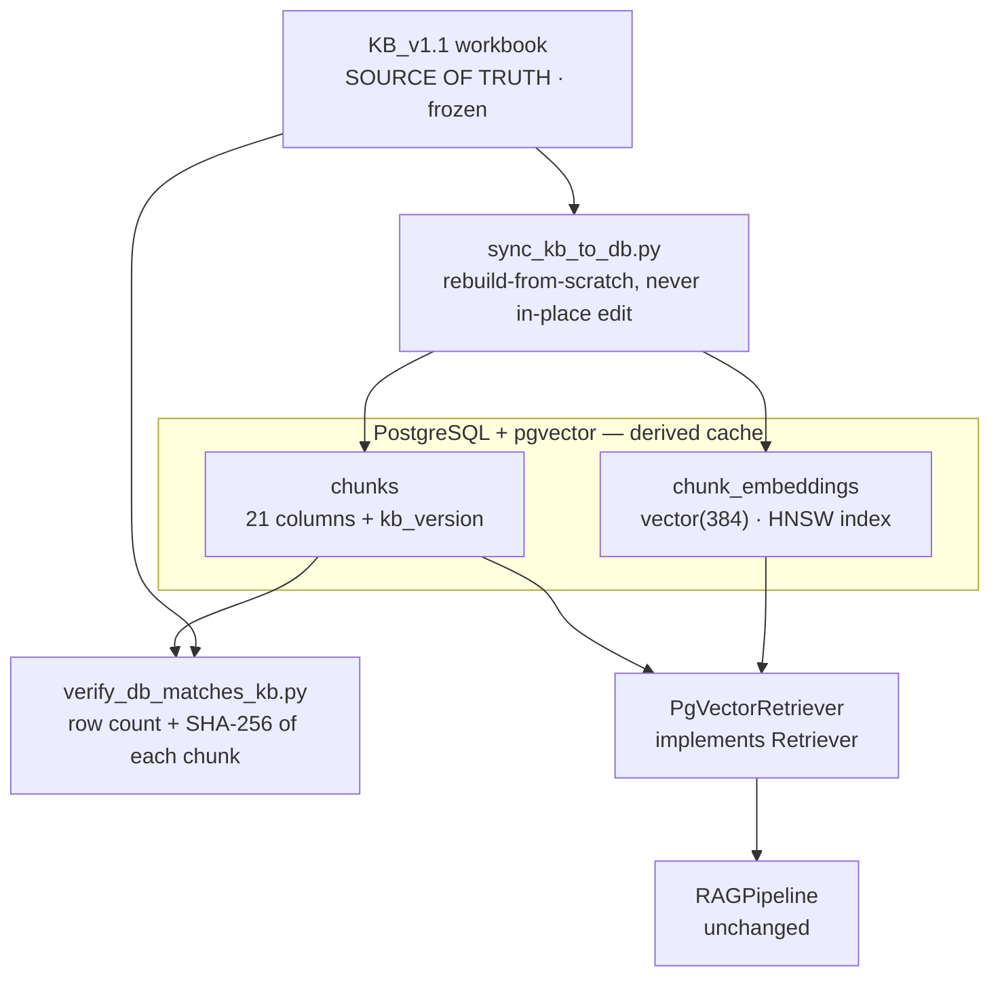

# Data store — decision, design and activation criteria

**Status:** decided. No database is provisioned. Retrieval runs in process over
the frozen knowledge base.

**This is a decision, not an omission.** It is written down here because an
undocumented decision is indistinguishable from an oversight, and this one will
be asked about.

---

## 1. The decision

The current pipeline loads `KB_v1.1/KB_v1.1_final/knowledge_chunks.xlsx` at
startup, builds a BM25 index in memory, and answers from it. There is no
PostgreSQL, no pgvector, and no persistence layer.

### Measured, on the development machine

| | |
|---|---|
| Corpus | 1,745 chunks, 21 fields each |
| Knowledge base on disk | 411 KB (one `.xlsx`) |
| Index build, cold (includes reading the workbook) | **510 ms** |
| Retrieval per query, median | **1.8 ms** |
| Retrieval per query, p95 | **2.8 ms** |

Reproduce with `python scripts/check_setup.py` (step 6) or by timing
`RAGPipeline.retrieve` directly.

A database would make this **slower**, not faster: it adds a network round trip
and a query planner to something currently happening in a Python process's own
memory. There is no latency problem to solve, no concurrency problem at this
scale, and no dataset that does not fit comfortably in RAM.

---

## 2. Why pgvector specifically is not yet warranted

pgvector exists to store and search **embeddings**. This project has none.

Dense retrieval is implemented (`src/embeddings/provider.py`,
`DenseRetriever` and `HybridRRFRetriever` in `src/retrieval/retrievers.py`) and
unit-tested, but it has never produced a vector: `huggingface.co` returns HTTP
403 from our environment's egress proxy, confirmed independently in two separate
sandboxes. No embedding weights can be downloaded, so no embeddings exist. See
[BLOCKERS.md](BLOCKERS.md).

The code's response to this is deliberate and worth stating: the provider raises
`ModelUnavailableError` rather than returning fake vectors, and `DenseRetriever`
refuses a mock provider unless explicitly told to allow one. A placeholder
number cannot leak into a reported result.

**Provisioning a vector database today would mean standing up storage for data
that does not exist.** The correct order is: unblock embeddings → measure
whether dense or hybrid retrieval actually beats BM25 on our evaluation set →
*then* provision storage for the approach that won.

---

## 3. The argument that actually decides it

The other two arguments are about cost and timing. This one is about
correctness.

**KB_v1.1 is frozen.** It is validated (0 errors, 0 warnings), hash-verified
against KB_v1 for the untouched files, and its manifest states it must not be
edited in place — any change requires a new version, a new manifest, full
re-validation and a regression run. Every retrieval number this project reports
is measured against that exact file.

Moving the corpus into a mutable database would mean:

- the corpus can drift silently between runs, with no manifest and no hash;
- "we re-ran the benchmark and got a different number" becomes possible, and
  unattributable;
- the freeze — the thing that makes our results reproducible by a third party —
  is replaced by a promise that nobody edited a table.

That is a bad trade for infrastructure that is not needed. If a database is
introduced later, **the workbook remains the source of truth and the database is
a derived cache**, rebuilt from it and verified against it (§5).

---

## 4. Current architecture


No persistent store appears because none exists. Everything from the workbook to
the index lives in the service process and is rebuilt at startup in half a
second.

---

## 5. Designed integration — what we would build, when it is warranted

This section exists so the architecture can be shown and defended without
building it. Nothing below is implemented.

### 5.1 Position in the system

PostgreSQL would sit **behind the existing `Retriever` interface**, not beside
it. `src/retrieval/retrievers.py` already defines that interface (`index()`,
`retrieve()`), and `RAGPipeline` takes a retriever as a constructor argument
rather than hard-wiring one — so a `PgVectorRetriever` is a substitution at one
call site, not a refactor. That is the payoff of having built the abstraction
early.



### 5.2 Schema

```sql
-- The knowledge base, mirrored. kb_version makes it impossible to serve
-- chunks from one KB version alongside embeddings from another.
CREATE TABLE chunks (
    chunk_id        TEXT PRIMARY KEY,
    kb_version      TEXT NOT NULL,              -- 'KB_v1.1'
    document_id     TEXT NOT NULL,
    document_title  TEXT NOT NULL,
    organization    TEXT NOT NULL,
    authority_level TEXT NOT NULL,
    equipment       TEXT NOT NULL,              -- sentinels preserved verbatim
    equipment_subtype TEXT NOT NULL,
    topic           TEXT NOT NULL,
    subtopic        TEXT NOT NULL,
    knowledge_type  TEXT NOT NULL,
    verified_information TEXT NOT NULL,
    procedure       TEXT NOT NULL,
    frequency       TEXT NOT NULL,
    technical_limit_value TEXT NOT NULL,
    safety_information TEXT NOT NULL,
    troubleshooting_failure_information TEXT NOT NULL,
    applicability   TEXT NOT NULL,
    pdf_page        TEXT NOT NULL,
    source_section  TEXT NOT NULL,
    notes           TEXT NOT NULL,
    original_filename TEXT NOT NULL,
    content_sha256  TEXT NOT NULL,              -- integrity check against the workbook
    searchable_text TEXT NOT NULL,              -- sentinels already excluded
    tsv             TSVECTOR GENERATED ALWAYS AS (to_tsvector('english', searchable_text)) STORED
);

CREATE INDEX chunks_tsv_idx        ON chunks USING GIN (tsv);
CREATE INDEX chunks_equipment_idx  ON chunks (equipment);
CREATE INDEX chunks_document_idx   ON chunks (document_id);

-- Embeddings, separated so the model that produced them is recorded.
-- A vector is meaningless without knowing which model made it.
CREATE TABLE chunk_embeddings (
    chunk_id    TEXT REFERENCES chunks(chunk_id) ON DELETE CASCADE,
    model_name  TEXT NOT NULL,                  -- 'BAAI/bge-small-en-v1.5'
    dimension   INT  NOT NULL,
    embedding   VECTOR(384) NOT NULL,
    PRIMARY KEY (chunk_id, model_name)
);

CREATE INDEX chunk_embeddings_hnsw
    ON chunk_embeddings USING hnsw (embedding vector_cosine_ops);
```

Three notes on the schema, each of which is a decision:

- **`kb_version` and `model_name` are stored, not assumed.** Serving chunks from
  KB_v1.1 alongside embeddings generated from KB_v1 would be silently wrong and
  impossible to detect afterwards. The columns make the mismatch queryable.
- **Sentinels are preserved verbatim.** `NOT VERIFIED` is a fact about the
  knowledge base. Normalising it to `NULL` on the way in would destroy the
  distinction between "checked, nothing there" and "never checked".
- **`content_sha256` per chunk** is what §5.4 verifies against.

### 5.3 Sync, not edit

`scripts/sync_kb_to_db.py` (not written) would **drop and rebuild** from the
workbook. It would never support editing a chunk in the database. The moment
in-place edits are possible, the freeze is gone.

### 5.4 The verification that makes this safe

`scripts/verify_db_matches_kb.py` (not written) would load the workbook and the
database and assert:

1. identical chunk counts;
2. identical set of `chunk_id`s;
3. `content_sha256` matches for every chunk;
4. every embedding's `model_name` and `kb_version` are consistent.

Run in CI and before any benchmark. **Without this check the database is a
liability**, because a divergence would show up as an unexplained change in a
retrieval metric.

---

## 6. When this activates — explicit trigger conditions

Provision PostgreSQL when **any one** of these becomes true. Not before.

| Trigger | Why it changes the answer |
|---|---|
| Embedding weights can be downloaded and dense or hybrid retrieval is **measured to beat BM25** on evaluation_v2 | Only then do embeddings exist and only then are they worth storing |
| Corpus exceeds roughly 50,000 chunks, or index build exceeds ~10 s | In-memory rebuild at startup stops being free |
| More than one service instance must share state | A cache rebuilt per process stops being coherent |
| Query logs, user feedback or an audit trail must be retained across restarts | A genuine persistence requirement, unrelated to retrieval |
| A deployment target mandates it | Non-technical, but real |

Note that the first trigger is a **measurement**, not an intention. "We plan to
add dense retrieval" is not a reason to provision a vector store; "hybrid
retrieval measured 0.94 Recall@3 against BM25's 0.909" is.

---

## 7. What a database would not change

Worth saying plainly, because a database is often assumed to improve things it
does not touch:

- **Not answer quality.** Generation is unchanged; the model sees the same
  extracts.
- **Not the citation guarantee.** Citations are rebuilt from `Chunk` objects
  regardless of where those chunks were loaded from.
- **Not retrieval accuracy.** Storing BM25 in Postgres' full-text search would
  change the ranking function, and would require re-running the entire retrieval
  benchmark to confirm it had not regressed. Different, not better.
- **Not the confidence layer.** It consumes pipeline outputs, not storage.

---

## 8. Summary for a reviewer

> We use in-process retrieval over a frozen 1,745-chunk knowledge base:
> 510 ms to build the index, 1.8 ms median per query. A database would add
> latency without adding capability at this scale, and pgvector's purpose is to
> store embeddings we cannot yet generate — our environment blocks the model
> download, and we would rather report nothing than a placeholder.
>
> The bigger reason is that our knowledge base is frozen and hash-verified, and
> every number we report is measured against that exact file. Moving it into a
> mutable table would trade a reproducibility guarantee for infrastructure we do
> not use.
>
> The integration is designed — schema, sync-not-edit, and a verification script
> that fails if the database and the workbook diverge — and it activates on
> stated triggers, the first of which is measuring that dense retrieval actually
> wins.
